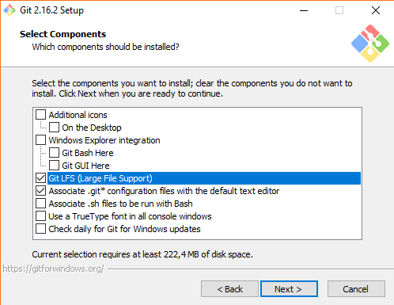
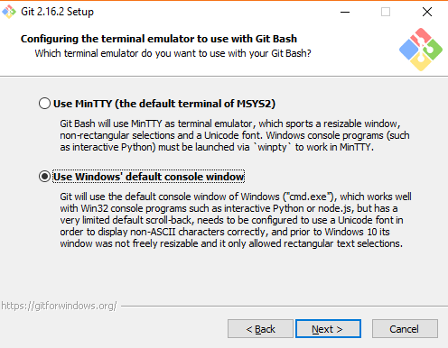
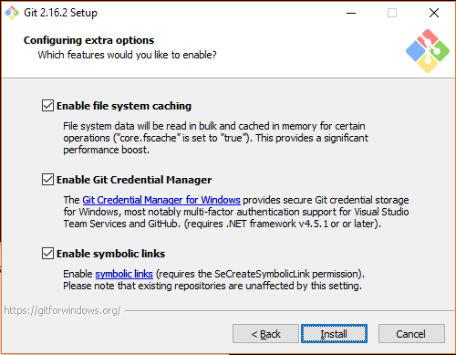
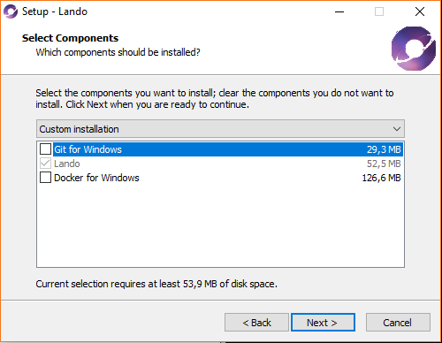
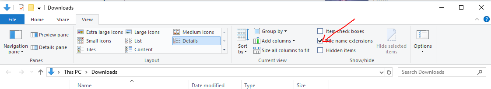

# Manual environment setup on Windows 10

## Enable required Windows features

Enable developer mode to be able to create symbolic links without an elevated prompt. You can do this by opening Windows Settings > Update & Security > For developers and select Developer mode.

Enable Hyper-V for Lando. Start a command prompt (cmd.exe) as an administrator and run:

```powershell
DISM /Online /Enable-Feature /All /FeatureName:Microsoft-Hyper-V
```

Enable Windows Subsystem for Linux (https://docs.microsoft.com/en-us/windows/wsl/install-win10) by running Powershell as an administrator and running:

```powershell
Enable-WindowsOptionalFeature -Online -FeatureName Microsoft-Windows-Subsystem-Linux
```

After that install Ubuntu from Microsoft Store and launch it to set it up. Use the same username as is your Windows username (visible from the C:\Users\username folder on the machine). This will help to use the same home folder on both Windows and Linux for shared ssh and git config.

## Install the basics and clone this repo

Manually download and install the basics:
- Docker for Windows https://store.docker.com/editions/community/docker-ce-desktop-windows
- Git for Windows https://git-scm.com/downloads
  - See [Git](#git) section below for screenshots of installation options.
  - For setting up the authentication keys see [SSH on Windows](#sshonwindows) section below.
- Lando https://github.com/lando/lando/releases
  - See [Lando](#lando) section below for screenshot of installation options.
- Microsoft Visual Studio Code https://code.visualstudio.com
  - See [Visual Studio Code](#code) section below for finalising the setup.
- Hyper https://hyper.is
- Comfort Clipboard Pro http://www.comfort-software.com/downloads.html
- TickTick https://ticktick.com
- Firefox https://www.mozilla.org/en-US/firefox
- 7-Zip http://www.7-zip.org
- PowerShell Core 6 https://github.com/PowerShell/PowerShell/releases

### <a name="git"></a>Git







### <a name="lando"></a>Lando



### Clone the repo

Create a projects directory if it doesn't exist already. Then clone the repo normally with git in a command prompt:
```powershell
mkdir %HOMEPATH%\Projects
cd %HOMEPATH%\Projects
git clone git@github.com:aleksijohansson/host-setup.git
```

## Configuration

### Hyper

To use Hyper with our configuration we need to link it into place. Run this in a command prompt:
```powershell
mklink %HOMEPATH%\.hyper.js %HOMEPATH%\Projects\host-setup\windows\.hyper.js
```

### <a name="code"></a>Visual Studio Code

TODO: Set the real paths below and see if we can use the same keybindings for Windows.

To use Visual Studio Code with our configuration we need to link it into place. Run this in a command prompt:
```powershell
mklink %HOMEPATH%\keybindings.json %HOMEPATH%\Projects\host-setup\dotfiles\Library\Application Support\Code\User\keybindings.json
mklink %HOMEPATH%\settings.json %HOMEPATH%\Projects\host-setup\dotfiles\Library\Application Support\Code\User\settings.json
```

### <a name="sshonwindows"></a>SSH on Windows

Windows 10 comes with beta of OpenSSH so just for funzies let's try it out. Also setting up the keys is required for Git anyway. It can be enabled from optional features. See Settings > Apps and click “Manage optional features” under Apps & features (https://blogs.msdn.microsoft.com/powershell/2017/12/15/using-the-openssh-beta-in-windows-10-fall-creators-update-and-windows-server-1709). OpenSSH port for Windows only works with id_ed25519 keys. Create the keys from 1Password in command prompt:

```powershell
code %HOMEPATH%\.ssh\id_ed25519
code %HOMEPATH%\.ssh\id_ed25519.pub
ssh-add %HOMEPATH%\.ssh\id_ed25519
```

### Firefox

Make Firefox a bit cleaner by going to `about:config` and setting `browser.urlbar.oneOffSearches` to `false`.

## Tips

Here's some tips that came up:

- To remove a git repo from Windows you need to force the removal of the folder like this: `rm -r -Force [folder]`. Otherwise you will get a permission error.
- Show file extensions of files in File Explorer:


