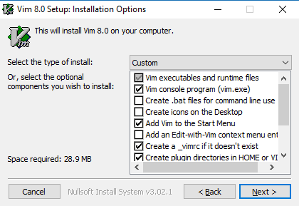
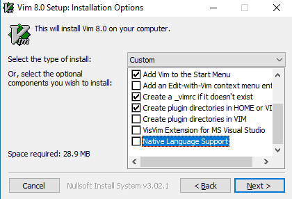

# Manual environment setup on Windows 10

## Install the basics and clone this repo

Manually download and install the basics:
- Lando https://github.com/lando/lando/releases
  - This will install also Docker for Windows and Git for Windows
- Atom https://atom.io
- Vim https://github.com/vim/vim-win32-installer/releases
  - See below for screenshots about the options during installation.
- Hyper https://hyper.is

### Vim

Select these options during the installation:






### Clone the repo

Create a projects directory if it doesn't exist already. Then clone the repo normally with git:
```
mkdir $env:HOMEPATH\Projects
cd $env:HOMEPATH\Projects
git clone git@github.com:aleksijohansson/host-setup.git
```

## Configuration

### Hyper

We want to use Hyper for running Powershell and to do that as an administrator so that we can create symbolic links etc. For this we need to do two things. Run Hyper as and administrator and use our own config for Hyper to run Powershell instead of the default cmd.exe.

To run Hyper as an administrator easily, find it from the start menu, right click and choose "Open file location". This opens the shortcuts folder in File Explorer. Right click the shortcut and select "Properties" and then select "Advanced" and make sure "Run as administrator" is checked.

To link our Hyper configuration into place run newly elevated Hyper, start Powershell and create the link:
```
powershell
New-Item -Path $env:HOMEPATH\.hyper.js -ItemType SymbolicLink -Value $env:HOMEPATH\Projects\host-setup\windows\.hyper.js
```

### Powershell

Some aliases are needed in Powershell to easily use git, vim and atom from Powershell. First allow running scripts (https://docs.microsoft.com/en-us/powershell/module/microsoft.powershell.core/about/about_execution_policies?view=powershell-6&viewFallbackFrom=powershell-Microsoft.PowerShell.Core) and then create the folder for Powershell profiles under Documents and symlink the `profile.ps1` to it. Continue in the Powershell in elevated Hyper we started in the previous section and run:

```
Set-ExecutionPolicy RemoteSigned -Scope CurrentUser
mkdir $env:HOMEPATH\WindowsPowerShell
New-Item -Path $env:HOMEPATH\Documents\WindowsPowerShell\profile.ps1 -ItemType SymbolicLink -Value $env:HOMEPATH\Projects\host-setup\windows\profile.ps1
```

### SSH

Windows 10 comes with beta of OpenSSH. It can be enabled from optional features. See Settings > Apps and click “Manage optional features” under Apps & features (https://blogs.msdn.microsoft.com/powershell/2017/12/15/using-the-openssh-beta-in-windows-10-fall-creators-update-and-windows-server-1709). OpenSSH port for Windows only works with id_ed25519 keys. Create the keys from 1Password:

```
vim $env:HOMEPATH\.ssh\id_ed25519
vim $env:HOMEPATH}\.ssh\id_ed25519.pub
ssh-add $env:HOMEPATH\.ssh\id_ed25519
```

## Tips

Here's some tips that came up:

- To remove a git repo from Windows you need to force the removal of the folder like this: `rm -r -Force [folder]`. Otherwise you will get a permission error.
- Show file extensions of files in File Explorer:


## More to explore

- https://git-scm.com/book/uz/v2/Appendix-A%3A-Git-in-Other-Environments-Git-in-Powershell
- https://www.develves.net/blogs/asd/articles/using-git-with-powershell-on-windows-10/
